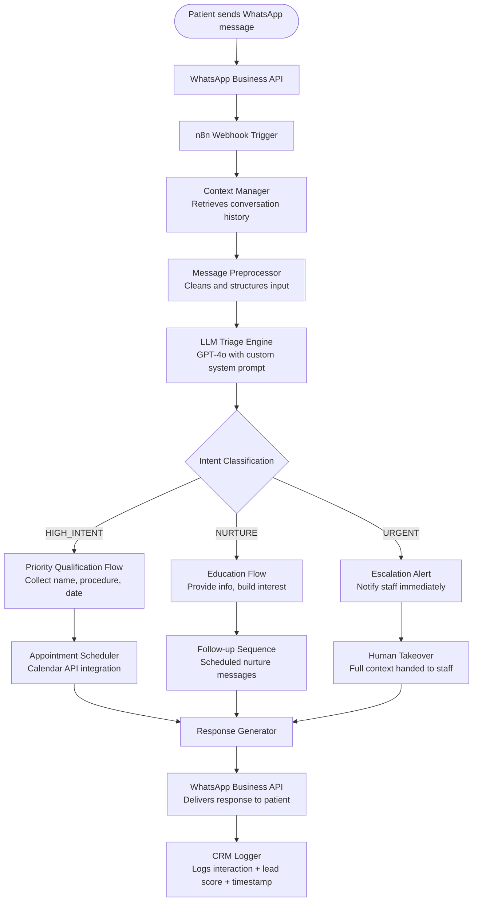

# System Architecture — AI WhatsApp Agent

## Overview

The system is built on a three-layer architecture:
- **Input Layer** — WhatsApp Business API webhook
- **Intelligence Layer** — n8n orchestration + LLM reasoning engine
- **Output Layer** — Response delivery + CRM logging

---

## Full System Flow


---

## Component Breakdown

### 1. WhatsApp Business API (Meta)
- Receives incoming messages via webhook POST request
- Delivers outgoing messages via REST API call
- Handles media, location, and interactive message types

### 2. n8n Orchestration Engine
The backbone of the entire system. Responsible for:
- Receiving and routing the webhook payload
- Managing conversation state between messages
- Calling external APIs (OpenAI, CRM, Calendar)
- Handling error states and fallback logic

**Key n8n nodes used:**
- `Webhook` — entry point for incoming messages
- `Function` — custom JavaScript for context management
- `HTTP Request` — OpenAI API calls
- `Switch` — intent-based routing
- `HTTP Request` — CRM and calendar integrations

### 3. LLM Triage Engine (GPT-4o)
The reasoning core of the agent. Receives:
- Full conversation history (context window)
- Current patient message
- System prompt with clinic-specific triage logic

Returns:
- Intent classification (`HIGH_INTENT` / `NURTURE` / `URGENT`)
- Structured response text
- Recommended next action

*See full system prompt: [`prompts/triage-agent.md`](../prompts/triage-agent.md)*

### 4. Context Manager
A stateful layer that persists conversation history between messages.
Without this, each message would be treated as a new conversation —
destroying the continuity essential for a premium patient experience.

**Implementation:** JSON object stored per session ID (WhatsApp number),
retrieved and updated on every message cycle.

### 5. CRM Logger
Writes structured data at the end of every interaction:
- Patient identifier (hashed phone number)
- Lead score (1–10, assigned by LLM)
- Intent classification
- Procedures of interest
- Preferred contact time
- Full conversation transcript

---

## Infrastructure

| Component | Technology | Hosting |
|---|---|---|
| n8n instance | n8n (self-hosted) | Cloud VPS (Linux) |
| LLM API | OpenAI GPT-4o | OpenAI Cloud |
| WhatsApp API | Meta Business API | Meta Cloud |
| Context Storage | JSON / lightweight DB | Same VPS |

---

## Error Handling & Fallbacks

| Scenario | Behavior |
|---|---|
| OpenAI API timeout | Retry once → fallback message → staff alert |
| WhatsApp API failure | Log error → queue message for retry |
| Unclassifiable intent | Default to NURTURE flow |
| Patient requests human | Immediate escalation trigger |
| Sensitive medical content | Auto-escalate to URGENT regardless of intent |
````
